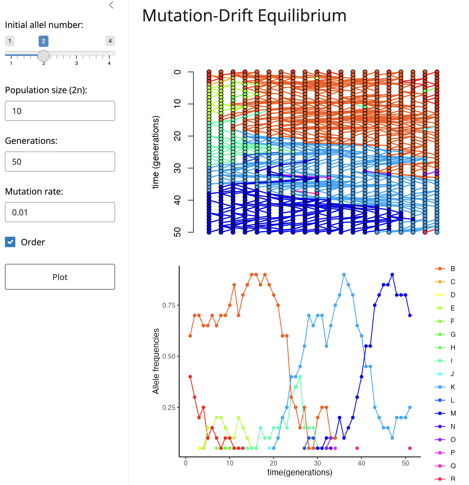

```{r setup, include=FALSE}
knitr::opts_chunk$set(echo = TRUE)
```




This is a small scritp that simulates the process of mutation drift in and constant size diploid population, the sumulation plot was a modification of the function ```coalescent.plot()``` that includes a mutation argument to add new alleles. Besides ploting the change in the alleles there is a plot of the alleles frequencies and of the homozygozyty and heterozygozyty.


To use the plot firts select the desired parameters and hit the ```Plot``` bottom. You have control over the number of initial allele, but not the initial frequencies that are random; the population size that dobles because we are assuming a diploid populations; the number of generations, and the mutation rate. You also can choose to sort the alleles each iteration of the simulation to make a plot easier to follow. 


