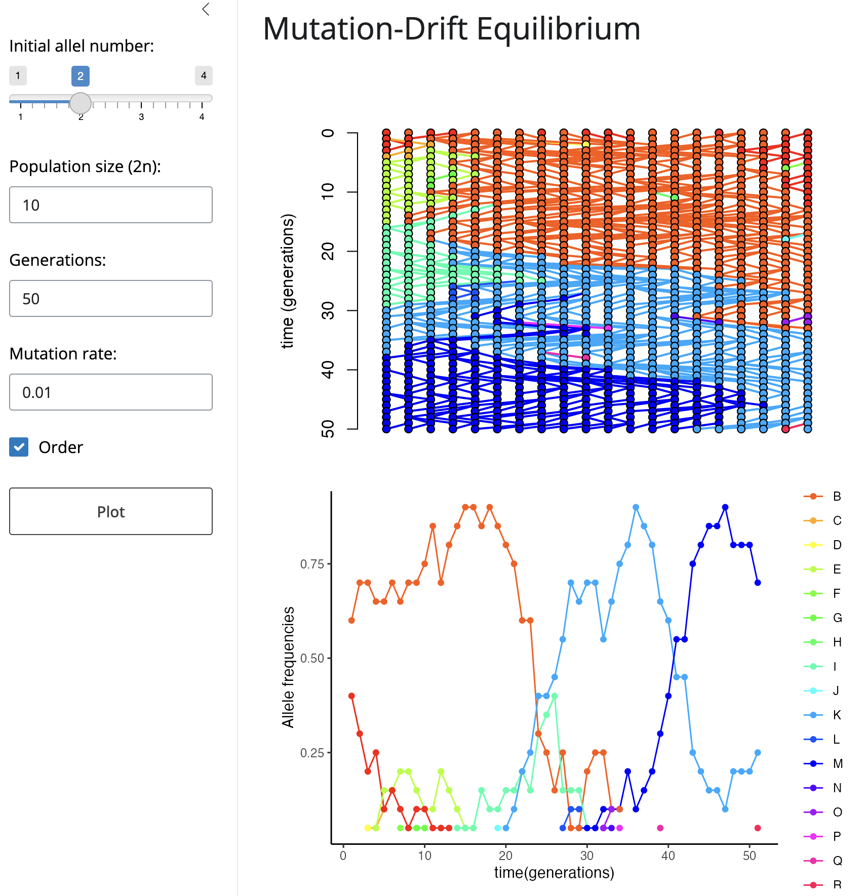
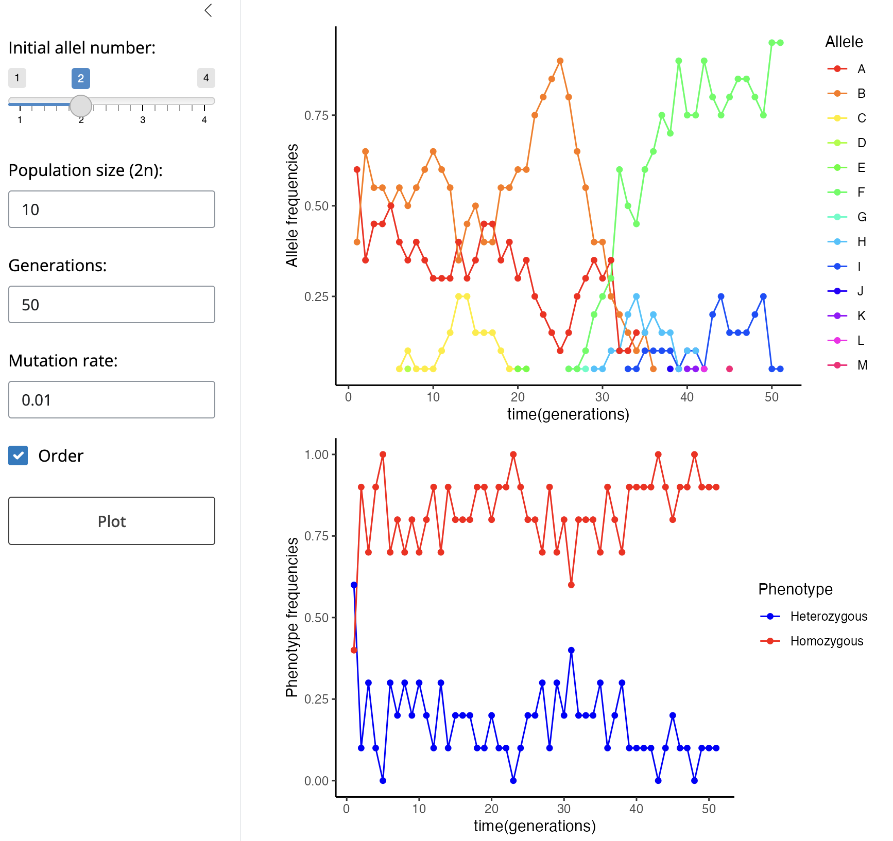

Mutation-Drift Equilibrium Simulator
================
Ramses A. Rosales-Garcia
2024 June 04

This is a small script that simulates the process of mutation drift in
and constant size diploid population, the simulation plot was a
modification of the
[function](http://blog.phytools.org/2018/03/coalescent-genealogy-plot-in-r.html)
`coalescent.plot()` that can be found in the
[package](https://cran.r-project.org/web/packages/learnPopGen/index.html)
`learnPopGen`. The function was modified to include a mutation argument
to add new alleles. In addition of plotting the change in the alleles
there is a plot of the alleles frequencies and of the homozygozyty and
heterozygozyty.

To use the plot firts select the desired parameters and hit the `Plot`
bottom. You have control over the initial number of alleles, but not the
initial frequencies that are random; the population size (N), note that
as we are assuming a diploid population we have 2N alleles; the number
of generations, and the mutation rate. You also can choose to sort the
alleles each iteration of the simulation to make a plot easier to
follow.
